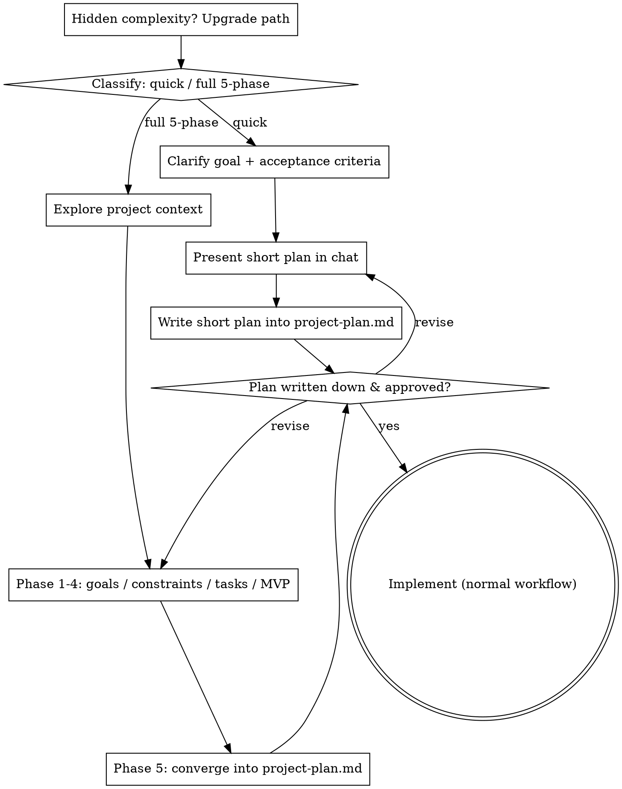

# Project Manager

> **Languages:** [English](SKILL.md) | [中文](SKILL.zh-CN.md)

## Overview

Turns a vague coding idea into a **structured, written-down** plan: first clarify goals and acceptance criteria, then settle the technical approach, break the work into executable tasks, prioritize with a clear MVP core path, and finally converge on a concise `project-plan.md`.

**Core principle: a plan that isn't written down is no plan at all.** Every conclusion from the discussion must land in the document, not stay in the conversation.

<HARD-GATE>
Do NOT write any code, scaffold any project, or take any implementation action until every conclusion has been recorded in `project-plan.md` and your human partner has approved it. This gate does not scale with task size — a "simple" idea still gets its plan written down and confirmed. An idea that lives only in the conversation (or in someone's head) is not a plan.
</HARD-GATE>

## When to Use

Use for one-time **upfront planning before writing code**. Good fits:
- Starting a brand-new development project
- The idea is still vague and you don't know where to start
- Details are easily missed and rework is common
- You want a written plan before starting

**Do not use** for mid-development progress tracking or on code that's already written.

## Two Paths

Before asking your first question, classify the request and say the classification out loud so your human partner can override it:

- **Quick plan** — a small, well-scoped idea where the flow is mostly settled in conversation: a minor feature, a single-utility helper, a small script. Compress to the essentials: clarify the goal and acceptance criteria, present a short plan IN CHAT (a few sentences to a short paragraph), and STOP. Write the short plan into `project-plan.md` and get approval before implementing. No deep phase-by-phase interrogation.
- **Full 5-phase plan** — a brand-new project, a vague idea, multiple subsystems, anything with hidden complexity. Walk the full 5-phase guided conversation below. This is the default for new projects.

When in doubt between the two paths, take the heavier one. The ratchet is one-way: hidden complexity discovered mid-way upgrades the path — stop, say so, and step up. Nothing downgrades mid-task.

## Anti-Pattern: "Simple Enough to Skip Writing It Down"

Every path ends with the plan written down and approved before implementation. A one-function utility, a tiny script — the plan may be two sentences in `project-plan.md`, but you MUST write it and get approval. "Simple" ideas are exactly where unexamined assumptions cause the most rework. What scales with simplicity is the length of the plan, never the gate.

## Core Pattern: 5-Phase Guided Conversation

Walk through the 5 phases in order (the full path). In each phase, use questions to make the other party say their thinking out loud, **and record/confirm the conclusion** rather than leaving it in their head. Don't jump to the next phase before finishing the current one.

| # | Phase | Questions to resolve |
|---|-------|----------------------|
| 1 | Goals & acceptance criteria | What does success look like? Core requirements? What "must be able to…"? |
| 2 | Technical constraints & stack | Existing tech stack? Platform/environment constraints? Language/framework preference? Need persistence/network/third-party deps? |
| 3 | Module & task breakdown | Which modules? Which executable tasks per module? Dependencies between tasks? |
| 4 | Prioritization & MVP | Which path is core and must-do? What can be postponed? What can be cut? |
| 5 | Converge into a document | Assemble phases 1-4 into `project-plan.md`. |

**Questioning tips**:
- Ask one key question at a time; wait for the answer before the next.
- When something is vague or undefined (e.g. "handle all errors"), ask for the concrete scope.
- After each phase, restate the conclusion in a line or two to confirm before moving on.

## Quick Reference (Output Structure)

Generate a concise `project-plan.md` that fits on one screen:

```markdown
# <Project Name>
## Goals & Acceptance Criteria
- what success looks like
- core requirements
## Technical Approach
- stack / constraints / module layout / data flow
## Task List
- [ ] task one (priority: P0 | depends on: none) one task per line
- [ ] task two (priority: P1 | depends on: task one)
## Prioritization & MVP Core Path
- must-do (core path) / can postpone / can cut
```

One **task per line**, each tagged with priority and dependencies. Save the file at the project root by default, or ask where to put it.

## Checklist

Classify first, announce the path, then complete the items on your path in order.

**Quick plan:**
1. **Clarify goal + acceptance criteria** — the ones that matter, one at a time
2. **Present short plan in chat** — goal, approach, files touched, testing
3. **Write it into `project-plan.md`** — a short plan, but written down
4. **Get approval** — STOP and wait for an explicit yes before implementing
5. **Implement** — proceed with the normal development workflow

**Full 5-phase plan:**
1. **Explore project context** — check existing files, docs, stack if any
2. **Phase 1 — Goals & acceptance criteria**
3. **Phase 2 — Technical constraints & stack**
4. **Phase 3 — Module & task breakdown**
5. **Phase 4 — Prioritization & MVP core path**
6. **Phase 5 — Converge into `project-plan.md`** and confirm it's complete
7. **Get approval** — explicit yes before implementation begins
8. **Implement** — normal development workflow; the plan file is your contract

## Process Flow



## Common Mistakes

| Mistake | Fix |
|---------|-----|
| Listing features and starting right away, no acceptance criteria | Do phase 1 first; define what "done" looks like |
| Assuming a tech stack without asking about constraints | Must confirm in phase 2 |
| Tasks without dependencies | Tag each task's dependencies in phase 3 |
| Mixing all requirements together, no priorities | In phase 4, separate MVP core path from cuttable items |
| Ending the discussion without a document | Phase 5 must produce `project-plan.md` |
| Asking many questions at once | Ask one at a time |

## Red Flags — Signals You've Gone Off Track

| Thought | Reality |
|---------|---------|
| "This idea is simple, I'll just start coding" | Simple means a short plan, not no plan. Write it down and get approval. |
| "The tech stack is obvious, no need to ask" | Constraints must be confirmed (phase 2), never assumed. |
| "I'll keep the conclusions in my head and write them later" | A plan not written down is no plan at all. Record each conclusion as you go. |
| "I'll call this quick and skip the document" | Reaching for a label to skip writing IS the doubt — take the heavier path. |
| "It grew bigger, but I'm almost done planning" | Hidden complexity upgrades the path mid-way. Stop, say so, and step up. |
| "I can list features now and worry about 'done' later" | Define acceptance criteria first; everything else is guesswork. |

**If any of these appear = stop and go back to the corresponding phase to fill the gap.**
