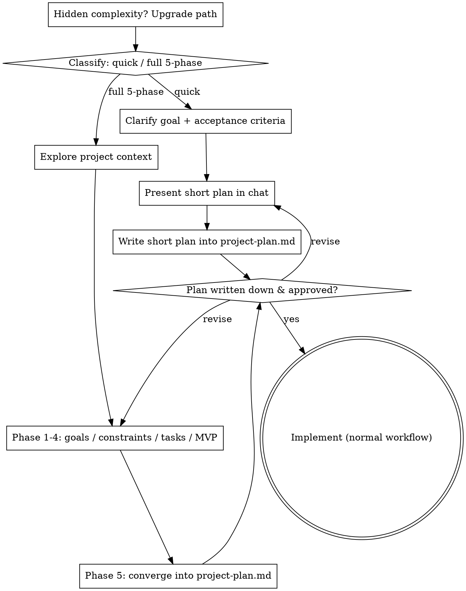

# 项目经理（Project Manager）

> **语言：** [English](SKILL.md) | [中文](SKILL.zh-CN.md)

## Overview

把模糊的编程想法变成**结构化、写下来**的规划：先明确目标和验收标准，再定技术方案，拆成可执行任务，排好优先级与 MVP 核心路径，最后收敛成一份简洁的 `project-plan.md`。

**核心原则：不写下来的规划等于没有规划。** 每一步讨论的结论都要落到文档里，而不是停留在对话中。

<HARD-GATE>
在每条结论都写入 `project-plan.md` 并得到对方明确批准之前，不得开始写任何代码、搭建项目或采取任何实现动作。此门禁不随任务大小缩放——"简单"的想法同样要写下来并确认。只活在对话里（或某人脑子里）的想法不叫规划。
</HARD-GATE>

## When to Use

用在**动手写代码之前**的一次性前期规划。适用场景：
- 开始一个全新开发项目
- 想法还很模糊，不知道从哪下手
- 容易遗漏细节、经常返工
- 想要一份书面计划再开工

**不要用**在开发中途的动态进度管理、或已经写完的代码上。

## 两条路径

在抛出第一个问题之前，先判断请求归属并说出口，好让对方能纠正你：

- **快速规划（Quick plan）**——范围小、边界清晰、流程基本能在对话里敲定的想法：一个小功能、一个单函数工具、一个小脚本。压缩到最简：先澄清目标和验收标准，在对话里给出简短规划（几句话到一小段），然后停下。把简短规划写进 `project-plan.md`，获批后再实现。不需要逐阶段深挖。
- **完整 5 阶段规划（Full 5-phase plan）**——全新项目、模糊想法、包含多个子系统、或藏着隐藏复杂度的任务。走下面完整的 5 阶段引导对话。新项目的默认路径。

两者拿不准时，取更重的那条。棘轮只能单向：中途发现隐藏复杂度就升级路径——停下、说明、升上去。中途绝不降级。

## Anti-Pattern：「简单到不用写下来」

每条路径都以"计划已写下并获批"为前提交付。一个单函数工具、一个小脚本——`project-plan.md` 里的计划可以只有两句话，但**必须写下来并获批**。恰恰是"简单"的想法最容易因未经审查的假设造成返工。随简单程度缩放的是计划的篇幅，绝不是门禁。

## Core Pattern：5 阶段引导对话

按顺序走完 5 个阶段（完整路径）。每阶段用提问引导对方明确说出想法，**并把结论记录/确认下来**，不要停留在脑子里。一个阶段没走完别跳到下一个。

| # | 阶段 | 要明确的问题 |
|---|------|--------------|
| 1 | 目标与验收标准 | 做成什么样算成功？核心需求？有哪些"必须能……"？ |
| 2 | 技术约束与选型 | 现有技术栈？环境/平台约束？语言框架倾向？要不要持久化/联网/第三方依赖？ |
| 3 | 模块与任务拆解 | 分哪些模块？每个模块拆成哪些可执行任务？任务间的依赖关系？ |
| 4 | 优先级与 MVP | 哪些是核心必做路径？哪些可后置？哪些可砍？ |
| 5 | 收敛成文档 | 把 1-4 的结论整理成 `project-plan.md`。 |

**提问要点**：
- 一次问一个关键问题，等对方答完再问下一个。
- 发现含糊/没定义清楚的地方（如"处理各种错误"），追问具体范围。
- 每个阶段结束，用一两句话复述确认，再进入下一阶段。

## Quick Reference（产出文档结构）

对话收敛后生成 `project-plan.md`，简洁、一屏能扫完：

```markdown
# <项目名>
## 目标与验收标准
- 做成什么样算成功
- 核心需求列表
## 技术方案
- 技术栈 / 约束 / 模块划分 / 数据流
## 任务清单
- [ ] 任务一（优先级：P0｜依赖：无）每个任务一行
- [ ] 任务二（优先级：P1｜依赖：任务一）
## 优先级与 MVP 核心路径
- 必做（核心路径）／可后置／可砍
```

任务**一行一个**，标注优先级和依赖。文档默认存项目根目录，或询问对方放哪。

## Checklist

先分类并说出口，然后按路径顺序逐条完成。

**快速规划：**
1. **澄清目标 + 验收标准**——只问关键的，一次一个
2. **对话里给出简短规划**——目标、方案、改动文件、测试
3. **写进 `project-plan.md`**——计划可以短，但必须写下来
4. **获批**——停下，等明确"可以"，再实现
5. **实现**——按正常开发流程推进

**完整 5 阶段规划：**
1. **探索项目上下文**——先看已有文件、文档、技术栈（如有）
2. **阶段 1——目标与验收标准**
3. **阶段 2——技术约束与选型**
4. **阶段 3——模块与任务拆解**
5. **阶段 4——优先级与 MVP 核心路径**
6. **阶段 5——收敛成 `project-plan.md`**，并确认完整
7. **获批**——实现前必须得到明确"可以"
8. **实现**——正常开发流程；规划文件就是你的契约

## Process Flow



## Common Mistakes

| 错误 | 修正 |
|------|------|
| 直接列功能就开干，没定验收标准 | 先走阶段 1，明确"成功长什么样" |
| 假设技术栈，不问约束 | 阶段 2 必须确认 |
| 任务没标依赖关系 | 阶段 3 每个任务标注依赖 |
| 所有需求混在一起，不分优先级 | 阶段 4 明确 MVP 核心路径 vs 可砍项 |
| 讨论完不落文档 | 阶段 5 必生成 `project-plan.md` |
| 一次抛多个问题 | 一次只问一个 |

## Red Flags —— 走偏信号

| 念头 | 现实 |
|------|------|
| "这想法很简单，我直接开写" | 简单意味着计划简短，不是没有计划。写下来并获批。 |
| "技术栈很明显，不用问" | 约束必须确认（阶段 2），绝不能假设。 |
| "结论先记脑子里，待会再写" | 没写下来的规划等于没有规划。边聊边把每条结论落档。 |
| "我算它快速，跳过文档" | 为了跳过写文档而贴标签本身就是疑虑——取更重的那条。 |
| "它变大变复杂了，但我快规划完了" | 隐藏复杂度中途要升级路径。停下、说明、升上去。 |
| "先列功能，'完成'标准以后再说" | 先定义验收标准，其余都是猜测。 |

**以上任意一条出现 = 停下，回到对应阶段补全。**
